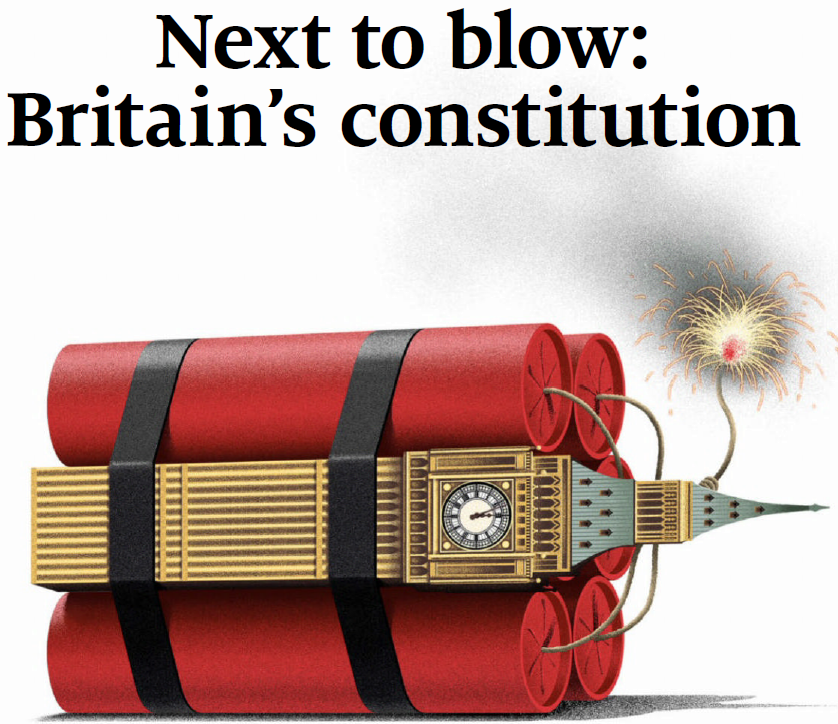

## Politics
### Brexit Chaos Worsen by British Constitution
The Briain constitution is "unwritten". It once showed its superiority, but with Brexit it is becoming more and more contentious. 
> The constitution is unclear on whether the executive or Parliament should prevail. 

The Brexit referendum never stated claerly the precise precedures of leaving the EU, not did it clarify the duty of all parties in performing a successful Brexit. As a result, the British are now facing the situation that a no-deal Brexit is approaching in Oct 31st.

What's worse, the recent trumph of Scotland Party in the EU parliament has made Scotland more confident in claiming indenpence from UK.
> Scotland voted Remain in the referendum, and the snp’s leaders can understandably
> claim that they have just won an enhanced mandate to leave the United Kingdom.

### Would Chineses Forget What have been done 30 years ago?
Sadly, maybe such filthy actions have already been forgotten.

## Economy
### Trade War
Alibaba’s experience shows how relations between America and China have soured

-------------------------------------------

Online Reading Link: [The Economist (2019-06-01)](https://onedrive.gimhoy.com/sharepoint/aHR0cHM6Ly9zanR1ZWR1Y24tbXkuc2hhcmVwb2ludC5jb20vOmI6L2cvcGVyc29uYWwvd3luOTgxNl9zanR1X2VkdV9jbi9FVlpZb042R3lVZExuQmszdWhhUGRia0JaV3pYR19BTTJpSndETEdYX1RGRjJBP2U9WWpUVVpI.pdf)   
*For reading ONLY, please do NOT share elsewhere.* 

