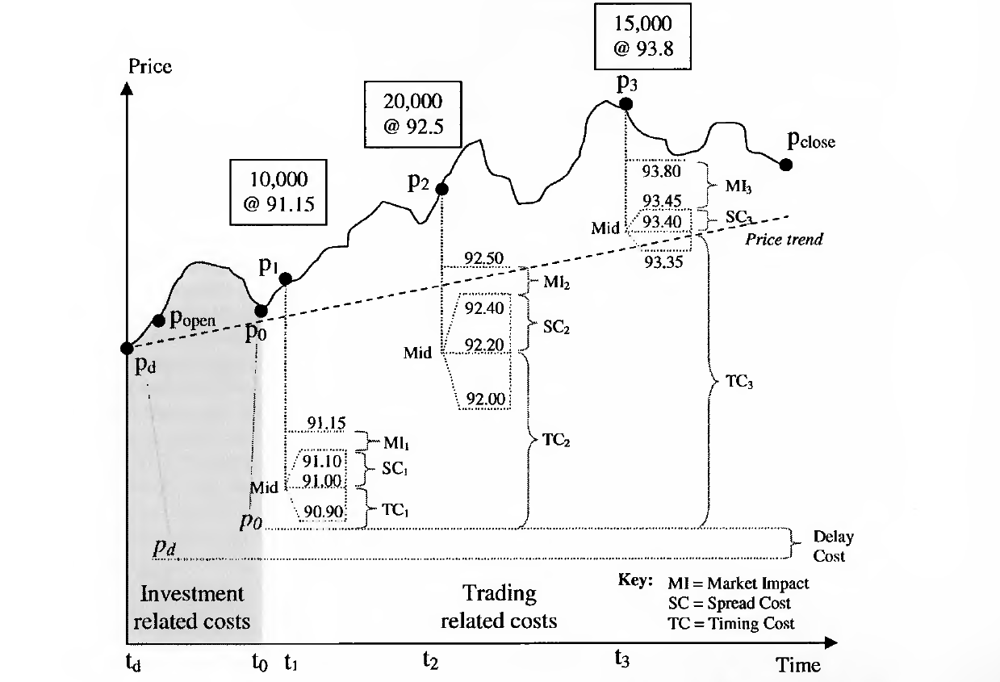
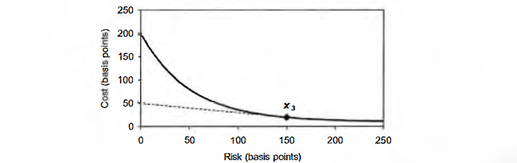

-------------------------

# [Chapter 1] Overview
## Trade Order Flow

首先，Buy side 决定一个下单，图中展示了五种 order flow

**[A] Traditional**  
下单给 sell-side, sell-side 可以跟自己的inventory交易，也可以拿到市场上去交易。

**[B][E] DMA**  
Buy-side通过broker的基础系统，直接连接到交易所并下单。  
更有甚者，buy-side可以得到sponsored access直接连接到交易所（往往是出于高频交易的需要）

**[C][D] Algorithm Trading**   
通过预算设定好的算法来做Execution，甚至也可以归类到是Buy-side DMA

另外，图中buy-side内部分工也可以关注一下。

很无奈的是，这种交易流水线已经让trader变成了executor，与其说算法交易，不如说algorithmic execution。

## Trading Algorithms

一开始就是TWAP和VWAP，后来通过不断地TCA，逐渐进化出了 Implementation Shortfall (IS)  
> These new algorithms tried to tackle what Robert Kissell and Morton Glantz (2003)  termed the trader's dilemma: **trading too fast brings high market impact costs whilst  trading too slowly exposes us to considerable risk**.

第三代的算法源自Liquidity。
很多第一代算法只关注 best bid-ask quotes，后来由于交易场所的增多、以及orderbook显示的更多，捕捉流动性的算法也变得重要起来。
通常通过 order routing system 来做，有时候routing到dark-pool也有。

## Trading Method Comparison

在效率上，算法交易非常有优势。  
在实用性上，DMA有更多的掌控权和透明度，而Crossing有最强的匿名性。  
另外，算法交易所需要的市场知识比较少。

## Fears and Myths
> It is important to remember that algorithmic trading is just a tool, not a panacea. It is not designed to generate profits (or alpha), simply to  help control costs and provide best execution

### Safety of algorithmic trading 
+ [x] Algorithms are fundamentally changing the market
+ [ ] Algorithms will replace traders
+ [ ] Algorithms can leak alpha to proprietary traders 
### Usefulness  of algorithmic trading
+ [ ] Algorithms arc complicated to use 
+ [ ] They only really work for liquid assets or small orders

# [Chapter 2] Market microstructure
## Transaction cost measurement and analysis
### Using Spreads
1. Quoted Spread  
   市场bid-ask。用来衡量市场情况。
2. Effective Spread   
   实际交易价格与**刚收到订单时的bid-ask中值**的差。用来衡量订单执行(Execution)。
3. Realized Spread  
   实际交易价格与**收到订单5min后的bid-ask中值**的差。用来衡量交易中间利润(Intermediary profits)。
### Using Benchmarks
1. Post-trade
   - Close
   - Future close
2. Intraday
   - Open-High-Low-Close(OHLC)的平均值
   - TWAP
   - VWAP
3. Pre-trade
   - Previous close
   - Opening price
   - Decision price
   - Arrival price

### Components of transaction costs
按照Visibility排序：

1. Commissions, Fees, and Taxes
2. Spread Cost
3. Delay Cost
4. Market Impact
5. Timing Cost  
6. Opportunity Cost

# [Chapter 3] World Markets 
## Asset Classes
- Equity
- Fixed Income
- Foreign Exchange (FX): including FX swaps
- Money Markets: including REPO, securities lending
- Derivatives
  - Futures and options
  - Swaps
  - Credit derivatives: including CDS (Credit Default Swaps)

## Market Structure
### Average Daily Turnover

最多的居然是 exchange traded (ET) derivatives

-------------------------------------------

# [Chapter 4] Orders
> Orders are the fundamental building block for any trading strategy.

## Order Types
- Market Order
  - depend on current market conditions (liquidity)
  - speed and certainty of execution
- Limit Order
  - lack of execution certainty
  - has potential to gain from future trend
- Market-to-limit orders
  - 最优五档成交剩余转限价
- Stop Orders
  - 当市场价格超出一定范围，止损单（也可以是止盈单）开始变为活跃的市价单
  - Stop limit order: 触发后变为限价单
  - Trailing stop orders: 当价格变化处于有利方向时，按兵不动；从最高点回落n%时，触发止损单
- Hidden Orders
  - 完全隐藏：可以用IOC订单来尝试cross
  - Iceberg/reserve orders: 像冰山一样，部分可见（书中有完整示例）
- Discretional orders
  - Not-held order：交易员完全自主的选择权
  - Discretionary orders：有一个
- Pegged orders
  - 动态的限价单，紧盯盘口
  - 还可以增加最小交易量限制，防止价格被小单子打上去
- 
- 

## Order Options
### Duration
- good for the day (GFD) 
- good til date (GTD)
- good tile cancel (GTC)
- good after time (GAT)

### Auction session instructions
集合竞价的指令，一般是为了最大化订单完成率
- market on open (MOO): 开盘集合竞价，若未成交则转限价或取消
- market on close (MOC)
- limit on close (LOC): 收盘限价单，限制交易价格or只有满足一定数量才交易

### Fill instructions
- Immediate or cancel (IOC): 允许部分成交，不管结果如何马上cancel
- Fill or kill (FOK): 如果没有立刻成交全部，就马上cancel
- All or none (AON): 如果**当天**没有全部成交的机会，就cancel  
  *这种单一般是low priority*
- Minimum volume / Minimum fill: 例如有AON order存在，使得有些单子有最小成交限制。
- Must be filled: 一般是期货期权的平仓换仓
- Flashing: 短暂的挂单后，马上撤单
- One-cancels-other (OCO)
- One-triggers-other (OTO) 

# [Chapter 5] Algorithm Overview
## Category

- Impact-driven：尽量减少市场冲击
- Cost-driven：尽量降低总的交易成本
- Opportunistic algo：抓住一切有利的交易条件

## Impact-driven
### TWAP
TWAP内容很简单，但是有一些变种。

Aggressive一开始做得快一些。

### VWAP
Given $n$ trades in a day, each with a specific price $P_n$ and size $v_n$
$$
\mathrm{VWAP} = \frac{\sum_n{v_nP_n}}{\sum_n{v_n}}
$$
但是预先不知道每天的实际交易情况，所以要进行估计。一般是拿历史数据计算每个时间段$j$的交易比例$v_j$，这样交易得到的VWAP价格为

$$
\mathrm{VWAP} = \sum_j{v_j\bar{P_j}}
$$

每个时间段的实际交易量目标是$x_j=v_jX$，其中$X$是总的订单量。

> **Trending/Tilting**
> 如果预计到一天内有趋势，那就可以将VWAP的分配适当向开始/结尾时间段倾斜

### Percent of Volume (POV)
> *AKA.* volume  inline, participation, target  volume or  follow algorithms  
> 保持对市场成交量的跟踪，一般是20%左右，什么时候做完了就结束。

**Detailed illustration**  
计算成交量比例时，要将自己的交易量也考虑在内，计算公式是
$$
MyTrade = TotalTrade\times\frac{x}{1-x}
$$
。其中$x$就是想要的比例，$\frac{1}{1-x}$被称作调整系数。

每15分钟作为一个区间，一个区间内按照累计交易量进行跟踪。

当市场已经成交了1700股时，需要成交的量是$1700*0.2/0.8=425\simeq400$

**Problems**  
- 如果大家竞争着交易一个流动差的资产，则会造成巨大的**Market Impact**
  - 使用price limit来避免
- 如果固定跟踪每段时间的交易量，容易被识别，造成**Signalling Risk**
  - 跟踪累计的成交量，缩小每段时间间隔
- 如果突然出现一些大单**Volume Spikes**，会使得瞬间落后于进度，这时候再去跟随已经来不及了
  - 将目标成交量和当前orderbook相比，或者设限忽略大额订单

**Common Variations**  
> **Price adaptive versions of POV algorithms**  
> 根据当前价格和某个benchmark（可以是VWAP，也可以是指数）比较，调整参与率

思考：如何识别？

## Cost-driven
### Implementation Shortfall (IS)
> Implementation shortfall represents the difference between the price at which the investor decides to  trade and the  average execution price that is  actually achieved. 
> 目标：下单时价格和实际成交价之间的差距最小

书中主要举例2类
- Based on statical trading schedules
    1. 根据全天 VWAP 的方法，算出每个时间段需要成交多少量，然后折算到客户规定的交易时间
    2. 添加一个 $tilt$ 参数（从1.3到0.7，每小时递减0.1）这种方式比较类似于 tilted VWAP
  
  例如8:45-9:00这个时间段：
  本来全天VWAP是需要5.8%的成交量，现在客户要求在14:30之前做完，所以这个时间段的交易量被放大到9.4%。  
  接着，$tilt$ 参数在此时为1.3，需要在上一步基础上再增加成交量，所以该时间段总的成交量$=10000 \times 9.4 \% \times 1.3 = 1222$

- Dynamic reaction to market volume
    1. 根据历史交易，当天14:30前大约有30000股成交，客户要求10000股，所以得到参与率33.3%
    2. 根据 INLINE Participation 的方法，参与33%的成交量，也就是市场每成交200股要下单100股
    3. 同样添加 $tilt$ 参数（从+3%，每小时递减1%），也就是一开始参与率36%，后来递减到35%, 34%...

*反思：感觉非常不智能，如果当天价格又回到下单价附近，岂不是可以一次性多买一些？算法中没有考虑到这个因素。*

### Adaptive Shortfall (AS)
基本原理就是在合适的价格时，提高Participation，多买一些。  

- Aggressive In-the-Money (AIM)
- Passive In-the-Money (PIM)

> An AIM strategy assumes that trends are  short-lived and will soon revert, whereas a PIM approach relics on the trend persisting  
> AIM建立在反转的基础上，PIM建立在趋势的基础上

## Opportunistic algorithms 
### Price Inline (PI)
基本上就是 Adaptive Shortfalls
### Liquidity Driven
> Liquidity aggregation: summing the available orders at each price point across all  the different  venues

基本原则：短期流动性充裕、订单簿很深、价格又很有利，就会加大参与度。

上图就是一个纯粹是Liquidity-driven的算法，**当市场条件不利的时候，就完全不交易**。同时，当市场条件有利的时候（价格下降、订单深度足够）就会出现Spikes

*此外，还有奇奇怪怪的Gamma Weighted Average Price (GWAP)等等，主要是对期权的交易。*

# [Chapter 6] Transaction Costs

##  Pre-trade analysis
### Price Data
**Markel prices, Price ranges, Trends/momentum**
### Liquidity data
#### **average daily volume (ADV)**  
ADV一般由过去30到90天的交易量计算，一般一天能做20-25%的ADV。  

可以使用ADV决定 $\mathrm{Trade Horizon }=\dfrac{\mathrm{Size}}{\mathrm{ADV}\times\alpha}$。
其中$\alpha$代表想要的交易参与率。

可以使用 coefficient of variation (CV)来衡量历史成交量的稳定程度。
$\mathrm{CV}=\sigma(\mathrm{ADV})/\mathrm{ADV}$  
如果当天才开盘一小时，就已经产生了50%ADV，那么很明显应该调整。
### Risk data
**standard deviation of price returns, beta**

## Post-trade analysis 
- **Benchmark comparison**  

对于特别大的订单（>30% ADV），用VWAP做比较可能不太好。

> **如何计算bps？**  
> 例如下单50000@90，实际执行了45000@92.63，VWAP@92.40  
> $\dfrac{(92.63-92.40)*45000}{50000*90}=0.23\%=23\ bps)$

- **Relative Performance Measure (RPM)**
> It is based on a comparison of what the trade achieved in relation to the rest of the market

$$
RPM(volume)=\dfrac{\mathrm{Total\ volume\ at\ price\ less\ favourable\ than\ execution}}{\mathrm{Total\ market\ volume }}
$$

$$
RPM(price)=\dfrac{\mathrm{Number\ of\ trades\ at\ price\ less\ favourable\ than\ execution}}{\mathrm{Total\ number\ of\ trades }}
$$

从公式可以看出，RPM的主要优势是normalized，而且可以在不同的资产/订单之间比较。

- **Implementation shortfall** 

理论上

$$
IS=Returns_{paper} - Returns_{real}
$$

现实中，设下单时间$P_d$，市场收盘价$P_N$，下单量$X$，算法拆单到每单$x_j$@$p_j$

$$I S=\underbrace{X\left(p_{N}-p_{d}\right)}_{\text {Returns }_{\text {paper }}}-\underbrace{\left(X p_{N}-\sum x_{j} p_{j}-f i x e d\right)}_{\text {Returns }_{R e a l}}=\sum x_{j} p_{j}-X p_{d}+\text { fixed }$$

如果更加真实一点，没有被全部执行，未执行的量是$\left(X-\sum x_{j}\right)$。

$$I S=\underbrace{\sum x_{j} \left(p_{j}-p_{d}\right) }_{\text {Fixecution Cost }}+\underbrace{\left(X-\sum x_{j}\right)\left(p_{N}-p_{d}\right)}_{\text {Opportunity cost }}+\text { fixed }$$

## Breaking down transaction costs 

- Timing Cost (TC)  
   Price Trend + Timing Risk (volatility, illiquidity, not-fully-execution) 
- Spread Cost (SC)
- Market Impact (MI)  
   Temporary Impact + Permanent Impact(infomation leakage)  
    如果一下子下单太大，击穿(Walk-the-book)，等到回复的时候就会留下Permanent Impact
- Opportunity cost
  由于off-limit / iliquidity，没有完全执行订单

## Transaction costs across world markets
书中都是旧数据了，到时候入职直接看ubs报告就完事了。

# [Chapter 7] Optimal trading strategies 
**拿到一个订单，如何选取最优的交易策略？**

## Difficulty of the orders
首先，估计交易的难易程度，综合考虑以下因素：
1. Order Size
2. Liquidity
3. Volatitlity
4. Price Momentum
5. Urgency
6. Trading Horizon 

这张图反映出不同ADV、不同流动性下的交易成本bps

## Efficient Trading Frontier
类似于Markowitz对股票的有效前沿理论，Robert Almgren and Neil Chriss (2000) 也对交易策略提出了类似模型(交易成本 vs. 交易风险)

$$\min _{x}(E(x)+\lambda V(x))$$

其中$E(x)$代表交易成本，$\lambda$代表风险偏好系数(大约在$10^{-6}$左右，和风险偏好程度成反比，和风险规避程度成正比)，$V(x)$代表风险()。

整个有效前沿如下图，横轴是Timing Risk或者Variance，纵轴是期望的交易成本。

上图还反映出不同的benchmark选择会导致不同的有效前沿。很明显，同样的cost下，使用昨收价的风险是很大的，使用今收价的风险最小。具体表达式如下

其中
- Permanent impact $g()$ ~ order size $X$
- Temporary impact $h()$ ~ order size $X$, trade rate $\alpha$
- Timing risk ~ price volatility $\sigma()$ ~ error factor/random noise $\epsilon$ 

主要由三种优化目标
1. 给定risk level，最小化cost
   
2. 给定cost level，达到price improvement
   
   给定cost level @ C，做切线与有效前沿相切，切点就是目标的最优化点。在图中，给定50bps的交易成本，通过承受150bps的择时风险，可以将交易成本降低到$X_3$处。
3. 平衡cost & risk
   
   给定风险偏好系数$\lambda$，以其为斜率做切线，可以将交易成本和择时风险平衡在$X_2$处。

有效前沿上不同的点，代表不同的交易算法或者不同的参数设定，一般可以如下标注

其中，TWAP是唯一不在边界上的点，因为它单纯拆单、没考虑市场情况。

##  A decision tree for strategy selection

