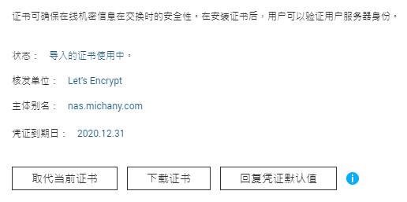

## Background
### System Environment
- 系统: QNAP TS-453Bmini QTS 4.4.3 (Linux)
- 域名服务提供商: Namecheap
- 网络服务提供商(ISP):上海电信
- 需要SSL的应用程序: QNAP管理界面，qBittorrent Web UI， Plex Media Server

### Pre-Analysis
首先，上海电信毫无疑问已经封锁了443端口，原本可以自动完成的Let's Encrypt `ACME.sh`服务必须借助80和443端口。而根据工信部的规定，所有托管在中国大陆服务器上的网站均需要备案。站点如未备案，80 端口处于禁用状态，acme.sh无法使用 HTTP 验证域名所有权，所以无法完成任务。

对此，只能采用DNS验证的替代方案（[参考](https://www.jianshu.com/p/1a792f87b6fe)）。DNS验证的原理是在域名上添加一条 txt 解析记录，一般是`_acme-challenge.{subdomain}`，来验证服务器身份。
- 优势：不需要服务器与公网ip的端口，只要配置 DNS 解析即可。
- 不足：必须配置 Automatic DNS API 才可以自动续签。

## Steps
### Namecheap DNS API
首先要根据域名服务商，选择对应的 [DNS API](https://github.com/acmesh-official/acme.sh/wiki/dnsapi)。我的域名提供商是namecheap，要使用 namecheap 的 DNS API 有个奇葩的规定就是需要消费金额达到50美金，所以不得已去消费了21美金将我的域名续费了2年，终于得以开通DNS API的权限。

开通后要手动添加 whilelist IP，直接添加发起证书认证的IP即可。如果该公网ip发生变更，应该需要重新添加，否则证书续签就会出错；不过证书一般3个月续签一次，频率不高，所以手动操作可以接受。

### ACME.sh 签发证书
```bash
export NAMECHEAP_USERNAME="MichanyW"
export NAMECHEAP_API_KEY="{API_KEY_FROM_NAMECHEAP}"
export NAMECHEAP_SOURCEIP="{SOURCE_IP_IN_WHILELIST}"

acme.sh --issue --dns dns_namecheap -d nas.michany.com --log
```
默认在`/root/.acme.sh/nas.michany.com/`目录下，得到以下几个Key


| 文件名           | 内容                                          |
| ------------------- | ----------------------------------------------- |
| ca.cer              | 中间证书和根证书                        |
| nas.michany.com.cer | 你申请的ssl证书                           |
| fullchain.cer       | 包括了 ca.cer 和 nas.michany.com.cer 的全链证书 |
| nas.michany.com.key | 证书的私钥                                 |
|

在QANP控制台->系统->安全->证书和私钥，上传证书和私钥后，既可以SSL访问。


在qBittorrent后台界面填写证书位置后，也可以开始SSL访问。


### Plex 所需证书
一点补充知识：
> **PEM格式**是证书颁发机构颁发证书的最常见格式。PEM证书通常具有扩展名，例如.pem，.crt，.cer和.key。它们是Base64编码的ASCII文件，包含“----- BEGIN CERTIFICATE -----”和“----- END CERTIFICATE -----”语句。服务器证书，中间证书和私钥都可以放入PEM格式。

> **PKCS＃12 / PFX格式**是二进制格式，用于将服务器证书，任何中间证书和私钥存储在一个可加密文件中。PFX文件通常具有扩展名，例如.pfx和.p12。PFX文件通常在Windows计算机上用于导入和导出证书和私钥。
将PFX文件转换为PEM格式时，OpenSSL会将所有证书和私钥放入一个文件中。

了解以上内容后，就可以将申请到的证书进行合并，转换得到PFX格式的证书：
```bash
cd /root/.acme.sh/nas.michany.com/
openssl pkcs12 -export \
-out        nas.michany.com.pfx \   # 输出文件
-inkey      nas.michany.com.key \   #私钥
-in         fullchain.cer \         #fullchain
#-certfile   nas.michany.com.cer \  #cert可不加，因为已经包含在fullchain中
-name "nas.michany.com" 
```
执行此命令后，它会要求你输入一个密码来加密这个pfx文件。

完成之后在Plex管理界面上更新三处内容：
- Custom certificate location: {path}.pfx
- Custom certificate encryption key: The password you entered 
- Custom certificate domain: {your domain}

**重启Plex服务（这一步很重要）！！** 就可以看到带锁的SSL界面了！

### Afterwards

由于Let's Encrypt证书每3个月续签一次，所以上述代码需要每次续签后执行，当然续签后还需要重启服务。同时，每次续签时要注意查看服务器公网ip是否发生变化，如果有变，需要在namecheap管理页面将新的ip加入whitelist。


